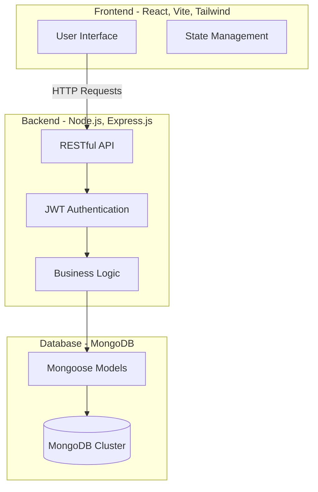

# 🌱 EcoShare – Smart Food Waste Management System

EcoShare is a comprehensive, full-stack platform designed to bridge the gap between food surplus and food scarcity. By connecting Restaurants, Students, NGOs, and Administrators, the system utilizes intelligent redistribution and real-time alerts to mitigate food waste at the source and efficiently allocate unavoidable surplus.

## 🚀 Features by Role

### 🍽️ For Restaurants & Donors
- **Surplus Posting:** Quickly upload details of surplus food (type, quantity, expiry time) to make it available for immediate donation.
- **Inventory & History Tracking:** Monitor past donations and track the impact of your contributions over time.
- **Real-Time Notifications:** Receive instant confirmation when an NGO or student claims your donation.

### 🎓 For Students & NGOs (Receivers)
- **Real-time Surplus Feed:** Monitor a live dashboard of available food donations from partnered restaurants and kitchens in your vicinity.
- **Automated Claiming:** Securely claim available food before it expires, ensuring fair distribution.
- **Instant Alerts:** Get notified instantly when new food becomes available nearby.

### 🛡️ For Administrators
- **User Management:** Oversee and verify registered restaurants, NGOs, and student accounts.
- **System Monitoring:** View platform health, monitor active donations, and resolve any disputes.

## 🏗️ System Architecture

The application follows a modern decoupled Client-Server architecture built on the MERN stack.



## 🗄️ Database Schema

The database utilizes MongoDB documents meticulously structured to handle complex associations between users and food listings.


## 💻 Technology Stack

- **Frontend:** React 19, TypeScript, Vite, Tailwind CSS, React Router v7, Framer Motion, Three.js, Recharts.
- **Backend:** Node.js (v20+), Express.js, JWT (JSON Web Tokens) for authentication, bcrypt for password hashing.
- **Database:** MongoDB, Mongoose ODM.

## ⚙️ Setup and Installation

### Prerequisites
- Node.js (v20+)
- MongoDB (Local instance or MongoDB Atlas URI)

### 1. Database Setup
1. Ensure your MongoDB server is running locally, or create a cluster on MongoDB Atlas.
2. Keep your MongoDB connection string handy (e.g., `mongodb://localhost:27017/ecoshare`).

### 2. Backend Setup
1. Open a terminal and navigate to the backend directory:
   ```bash
   cd backend
   ```
2. Install dependencies:
   ```bash
   npm install
   ```
3. Create a `.env` file in the `backend` directory and add your credentials:
   ```env
   PORT=5000
   MONGODB_URI=mongodb://localhost:27017/ecoshare
   JWT_SECRET=your_jwt_secret_key
   ```
4. Start the backend development server:
   ```bash
   npm run dev
   ```
   *The backend server will start on `http://localhost:5000`.*

### 3. Frontend Setup
1. Open a new terminal and navigate to the frontend directory:
   ```bash
   cd frontend
   ```
2. Install dependencies:
   ```bash
   npm install
   ```
3. Start the Vite development server:
   ```bash
   npm run dev
   ```
   *The frontend application will run on `http://localhost:5173`.*

## 📸 Screenshots

*(Replace these placeholder links with actual screenshots of your application)*

| Login Page | Donor Dashboard |
| :--- | :--- |
| [Login UI](#) | [Donor Portal](#) |

| Available Food Feed | NGO/Student Dashboard |
| :--- | :--- |
| [Surplus Feed](#) | [Receiver Portal](#) |

## 🤝 Contributing

Contributions, issues, and feature requests are welcome! Feel free to check the issues page.

## 📝 License

This project is MIT licensed.
