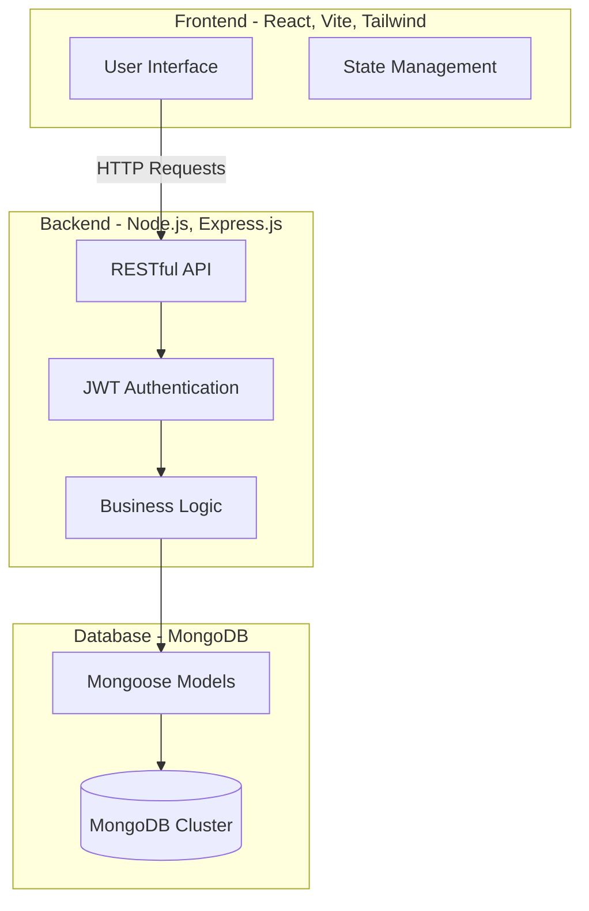
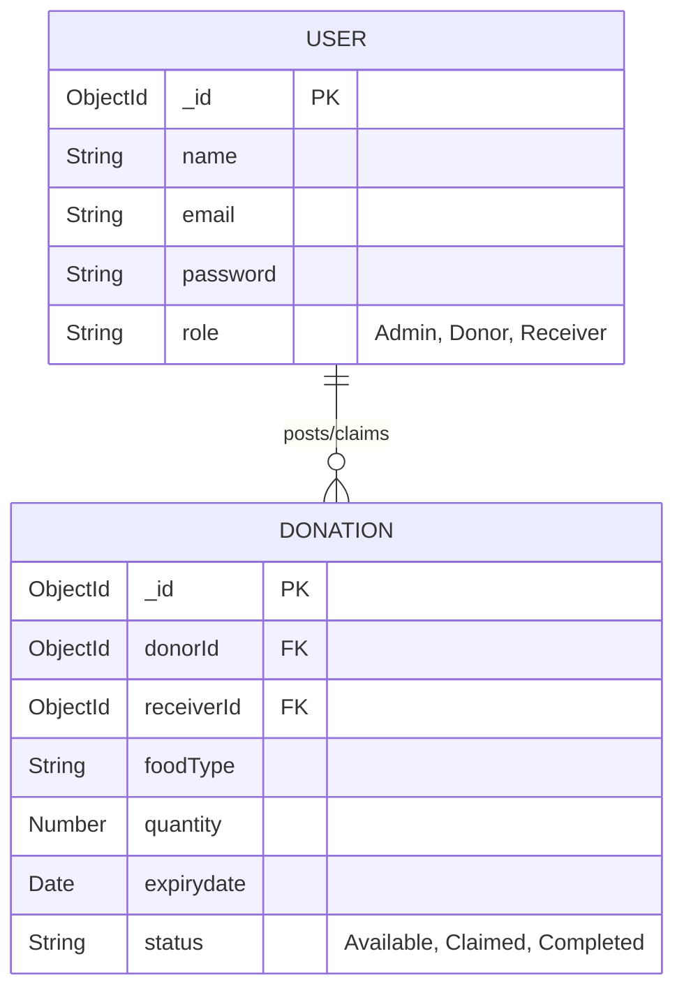

🌱 EcoShare – Smart Food Waste Management System

EcoShare is a comprehensive, full-stack platform designed to bridge the gap between food surplus and food scarcity. By connecting Restaurants, Students, NGOs, and Administrators, the system utilizes intelligent redistribution and real-time alerts to mitigate food waste at the source and efficiently allocate unavoidable surplus.

## 🚀 Features by Role

### 🍽️ For Restaurants & Donors
- **Surplus Posting:** Quickly upload details of surplus food (type, quantity, expiry time) to make it available for immediate donation.
- **Inventory & History Tracking:** Monitor past donations and track the impact of your contributions over time.
- **Real-Time Notifications:** Receive instant confirmation when an NGO or student claims your donation.

### 🎓 For Students & NGOs (Receivers)
- **Real-time Surplus Feed:** Monitor a live dashboard of available food donations from partnered restaurants and kitchens in your vicinity.
- **Automated Claiming:** Securely claim available food before it expires, ensuring fair distribution.
- **Instant Alerts:** Get notified instantly when new food becomes available nearby.

### 🛡️ For Administrators
- **User Management:** Oversee and verify registered restaurants, NGOs, and student accounts.
- **System Monitoring:** View platform health, monitor active donations, and resolve any disputes.

## 🏗️ System Architecture

The application follows a modern decoupled Client-Server architecture built on the MERN stack.



## 🗄️ Database Schema

The database utilizes MongoDB documents meticulously structured to handle complex associations between users and food listings.



## 💻 Technology Stack

- **Frontend:** React 19, TypeScript, Vite, Tailwind CSS, React Router v7, Framer Motion, Three.js, Recharts.
- **Backend:** Node.js (v20+), Express.js, JWT (JSON Web Tokens) for authentication, bcrypt for password hashing.
- **Database:** MongoDB, Mongoose ODM.

## ⚙️ Setup and Installation

### Prerequisites
- Node.js (v20+)
- MongoDB (Local instance or MongoDB Atlas URI)

### 1. Database Setup
1. Ensure your MongoDB server is running locally, or create a cluster on MongoDB Atlas.
2. Keep your MongoDB connection string handy (e.g., `mongodb://localhost:27017/ecoshare`).

### 2. Backend Setup
1. Open a terminal and navigate to the backend directory:
   ```bash
   cd backend
   ```
2. Install dependencies:
   ```bash
   npm install
   ```
3. Create a `.env` file in the `backend` directory and add your credentials:
   ```env
   PORT=5000
   MONGODB_URI=mongodb://localhost:27017/ecoshare
   JWT_SECRET=your_jwt_secret_key
   ```
4. Start the backend development server:
   ```bash
   npm run dev
   ```
   *The backend server will start on `http://localhost:5000`.*

### 3. Frontend Setup
1. Open a new terminal and navigate to the frontend directory:
   ```bash
   cd frontend
   ```
2. Install dependencies:
   ```bash
   npm install
   ```
3. Start the Vite development server:
   ```bash
   npm run dev
   ```
   *The frontend application will run on `http://localhost:5173`.*

## 📸 Screenshots


##Photo 1 (Homepage):

EcoShare's intelligent platform connects surplus food from campuses to NGOs, minimizing waste and maximizing community impact.


##Photo 2 (DSA Features):

Interactive DSA visualizations demonstrate how core algorithms power EcoShare's fast and efficient food redistribution system.


🧠 Data Structures & Algorithms Used in Our webiste :- 

🔹 Hash Map

Stores and retrieves user, NGO, and food donation records efficiently, enabling near O(1) average-time lookup and insertion.

🔹 Queue

Processes food donation requests in First-In-First-Out (FIFO) order, ensuring fair and organized request handling.

🔹 Priority Queue

Ranks available food donations based on urgency and expiry time so that high-priority donations are processed first.

🔹 Min Heap

Implements the Priority Queue, allowing the system to quickly identify donations with the earliest expiry time in O(log n) time.

🔹 Graph

Represents the network of donors, NGOs, and distribution points, enabling efficient route planning and resource connectivity.

🔹 Dijkstra's Algorithm

Computes the shortest path between food donors and nearby NGOs, reducing delivery time and transportation effort.

🔹 Greedy Algorithm

Selects the most suitable donation assignment by considering factors such as proximity and urgency, maximizing redistribution efficiency.

🔹 Merge Sort

Sorts food donation records by attributes such as expiry date and donation time with a guaranteed O(n log n) time complexity.

🔹 Binary Search

Performs fast searches on sorted food records and user data, reducing search time to O(log n).

🔹 Quick Sort

Efficiently sorts large collections of food listings and donation history using a divide-and-conquer approach with an average time complexity of O(n log n).


##Photo 3 (Workflow):

A step-by-step workflow shows how surplus food is matched, routed, and delivered efficiently using intelligent algorithms.


##Photo 4 (Student Dashboard):

The student dashboard enables users to browse, reserve, and track surplus food through a simple and interactive interface.


##Photo 5 (DSA Learning Module):

The DSA Learning module provides interactive algorithm visualizations to explain how search and optimization power food redistribution.


##Photo 6 (Kitchen Staff Dashboard):

The kitchen staff dashboard allows users to log, manage, and monitor surplus food listings for efficient distribution.


##Photo 7 (Administrator Dashboard):

The administrator dashboard provides real-time monitoring of users, food listings, system performance, and overall platform analytics.


##Photo 8 (DSA Learning Center):

The DSA Learning Center offers interactive simulations to help users understand algorithms used in EcoShare's food redistribution system.


##
Photo 9 (AI Decision Center):

The AI Decision Center intelligently recommends the best NGO and delivery route using Greedy, Dijkstra, and Priority Queue algorithms.
 

 
 ##website link:
[Visit wesbite]( https://eco-share-smart-food-waste-manageme.vercel.app/)


## 🤝 Contributing

Contributions, issues, and feature requests are welcome! Feel free to check the issues page.

