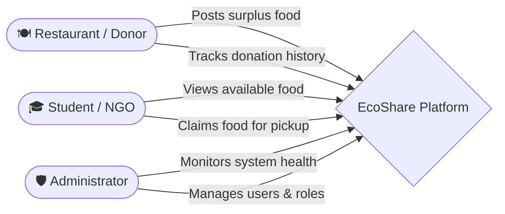
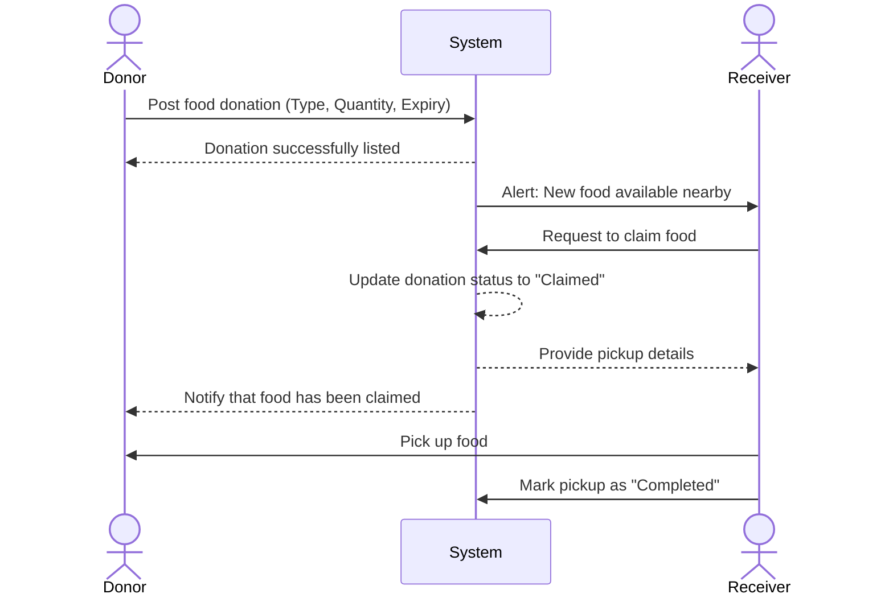

# 🌱 EcoShare – Smart Food Waste Management System

EcoShare is a full-stack MERN application that connects restaurants, students, NGOs, and administrators to reduce food waste through intelligent redistribution.

## 🏗️ System Architecture

## 👥 User Workflows

## 🔄 Food Donation Lifecycle

## 🚀 Features

- **Secure Access:** JWT Authentication & Role-Based Access Control (RBAC).
- **Interactive UI:** Fully responsive design with Dark/Light theme support.
- **Dynamic Frontend:** 3D elements and animations using Three.js and Framer Motion.
- **Scalable Architecture:** Built on the robust MERN stack.

## 🛠️ Tech Stack

| Frontend | Backend | Database | Tools & Libraries |
| :--- | :--- | :--- | :--- |
| React | Node.js | MongoDB | TypeScript |
| Vite | Express.js | Mongoose | Tailwind CSS |
| Framer Motion | JWT | | Recharts |
| Three.js | bcrypt | | React Query |

## 📌 Status

- ✅ **Phase 1:** Core Foundation & UI (Completed)
- 🚧 **Phase 2:** Advanced Features (Under Development)

## 👨‍💻 Author

Somnath Bhaskar